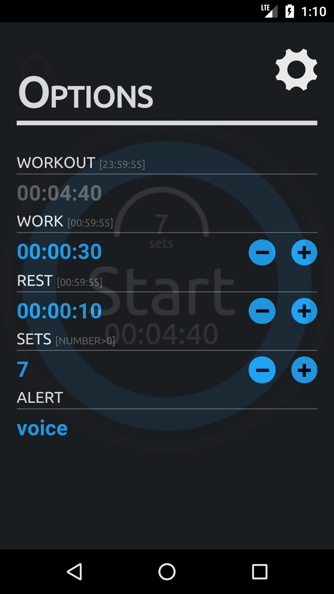
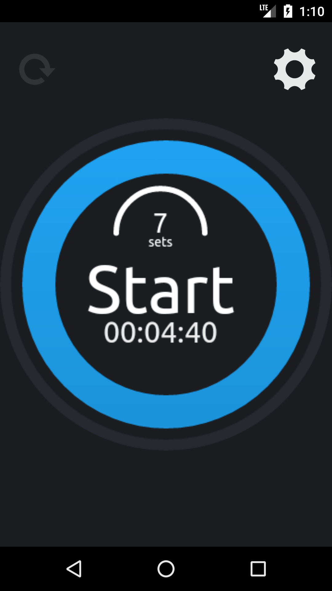
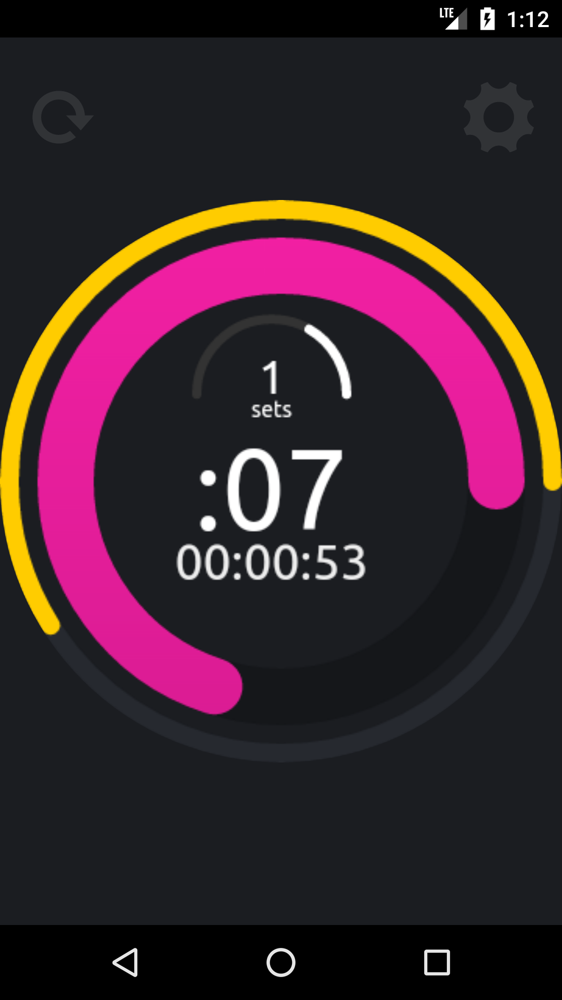
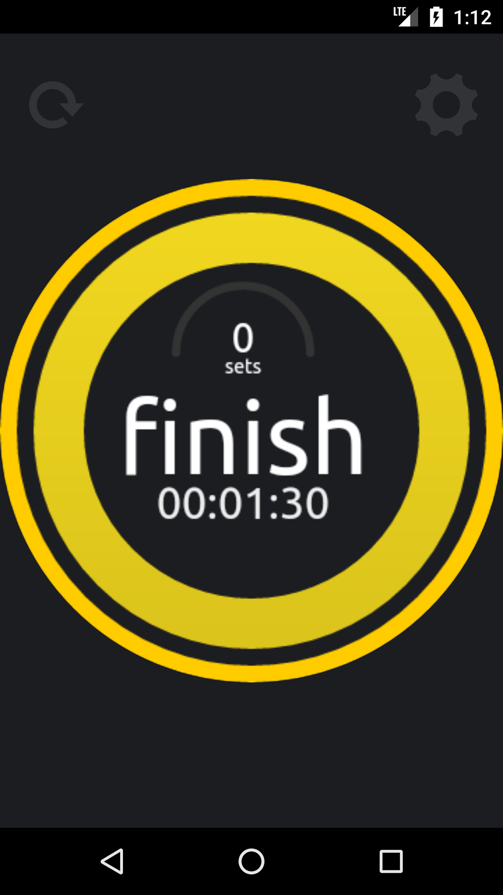

# Coach Timer


## Overview
Application for training sessions, build with Web technologies, [Cordova](https://cordova.apache.org/) framework and [Android Studio](https://developer.android.com/studio).

## Preview

<p float="left">
  
  
  
  
  
</p>

### Android
- [Download](https://reek.github.io/coach-timer/coach-timer.apk) and allow installation from `unknown sources` then install `coach-timer.apk`.


### Browser
- Navigate to Web App [Demo](https://reek.github.io/coach-timer/)

## Features
- Responsive Desktop and Mobile.
- Option panel with autosave.
- Edit Work, Rest and Sets values.
- Multiple alert modes [voice, whistle](https://developer.mozilla.org/en-US/docs/Web/API/Web_Audio_API) or [vibrate](https://developer.mozilla.org/en-US/docs/Web/API/Vibration_API).
- Start, pause and reset timer.
- Timer designed with the [Canvas API]() and SVG.

## Technologies
- [Cordova](https://cordova.apache.org/) - Mobile apps with HTML, CSS & JS, Target multiple platforms with one code base, Free and open source
- [HTML5](https://developer.mozilla.org/en-US/docs/Web/Guide/HTML/HTML5) - HTML 5 is a software solution stack that defines the properties and behaviors of web page content by implementing a markup based pattern to it.
- [SASS](https://sass-lang.com/) - Sass is completely compatible with all versions of CSS. We take this compatibility seriously, so that you can seamlessly use any available CSS libraries.
- [JQuery](https://jquery.com/) - jQuery is a fast, small, and feature-rich JavaScript library. It makes things like HTML document traversal and manipulation, event handling, animation and Ajax.

## Cordova
This [guide](https://cordova.apache.org/docs/en/latest/guide/cli/) shows you how to create a JS/HTML Cordova application and deploy.  

### Quick Start Android
```
$ cordova create coachtimer io.cordova.coachtimer CoachTimer
$ cd coachtimer
$ cordova plugin add cordova-plugin-browsersync
$ cordova platform add android
$ export ANDROID_HOME=$HOME/Android/Sdk
$ cordova build android
$ cordova emulate android
```

### Plugin
Add plugin to project `$ cordova plugin add <plugin-name>`

## Android SDK

### Accept licenses
```
$ touch ~/.android/repositories.cfg
$ ~/Android/Sdk/tools/bin/sdkmanager --update
$ ~/Android/Sdk/tools/bin/sdkmanager --licenses
```

### Using bash_profile to set ANDROID_HOME permanently.
Edit `~/.bash_profile` and add the lines below.
```
export ANDROID_HOME=$HOME/Android/Sdk
export PATH=$PATH:$ANDROID_HOME/tools:$ANDROID_HOME/platform-tools
```

## Tools
- [Generator](https://pgicons.abiro.com/) Icon and Splash (check all)

